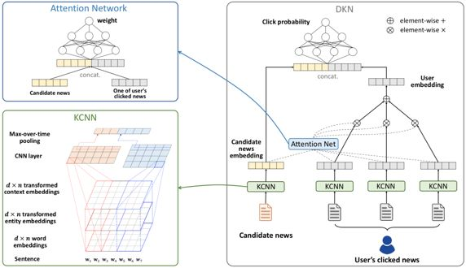

## DKN: 面向新闻推荐的深度知识感知网络

&gt; 笔记整理: 

笔记整理：仲亮靓，东南大学硕士研究生，研究方向是基于知识图谱的推荐系统

**动机**

新闻文本的语言非常凝练，其中包含了很多实体和常识知识。但目前的新闻个性化推荐方法都没有利用这些外部知识，也没有使用新闻之间潜在的知识层面的联系。这就导致推荐的结果总是局限于简单额匹配，不能合理地扩展。

为了解决以上的问题，文章中提出了基于内容的结合知识图谱来做新闻推荐（点击率预测）的方法DKN（Deep Knowledge-awareNetwork）。

**贡献**

文章的贡献有：

1）新提出的DKN模型是基于内容的深度学习推荐模型，适合像新闻这样的具有高度时效性的推荐

2）设计了KCNN（Knowledge-awareCNN）模块来联合学习新闻的语义层和知识层的表示

3）用Attention模块对用户历史点击过的新闻对于当前候选推荐新闻的影响程度进行建模

**方法**

文中提出的模型图如图 1 所示。

输入：一个用户点击过的新闻的标题、一条候选推荐新闻的标题

输出：用户点击这条候选新闻的概率

步骤：
- 将新闻标题中的词和知识图谱中实体做实体链接- 为每个实体搜索它在知识图谱中的相邻实体（以此来获得更加丰富、具有区分力的信息）- KCNN（融合新闻的词表示和新闻表示，得到一个新闻的Knowledge-aware的向量表示）<ul class="list-paddingleft-2" style="list-style-type: square;">- **多通道（****multi-channel****）**：把word embedding、entityembedding、上下文实体embedding作为CNN的三个通道- **词语****-****实体对齐（****word-entity-aligned****）**：
                将标题中的词向量和实体向量一一对应，如果词向量在知识图谱中没有与之对应的实体，就用0向量来填充。

            因为词向量和实体向量来自两个不同的向量空间且训练出来的相连的维度也不一样，所以通过一个线性或非线性 的方法将实体向量映射到词向量空间中。最终得到新闻的如下形式的矩阵表示：

其中，w_i 表示标题中第 i 个词的词向量，e_i 表示与第i个词对应的实体的向量，\bar{e_i} 表示第i词对应的实体在知识普图中的上下文信息（所有与它相邻的实体的向量的均值）
<ul class="list-paddingleft-2" style="list-style-type: square;">- 将得到的多通道堆叠矩阵放入CNN中，最终得到新闻的embedding结果
Attention-based 用户兴趣抽取

用户对于自己点击过的每个新闻话题的兴趣并不是完全一样的，所以用户点击过的每个新闻对于用户是否点击候选推荐新闻的影响力也是不一样的，因此这里需要加入Attention机制

输入：两条新闻标题（用户点击过的一条新闻和候选新闻）的KCNN embedding结果

输出：该条历史新闻对于候选新闻点击率的影响权重

将两个embedding结果做全连接，然后使用一个DNN（公式中用H表示）作为Attention网络，最后再用softmax函数来规格化影响权重，具体公式如下：

- 把这些历史新闻的向量和对应的权重，做加权平均，作为用户的embedding结果

- 最后再将用户的embedding结果、候选推荐新闻的embedded结果做全连接，放到一个DNN（公式中用G表示）中，得到最终的用户点击该条候选新闻的概率

图1 DKN算法模型框架

**实验**

**数据来源**：Bing News的系统日志

**数据特征**：实验中给出了新闻数据中新闻标题所含的词语数量平均值、新闻标题中包含的实体数量平均值、添加上下文实体后得到的实体数量平均值等，表明了加入知识图谱中的相邻实体确实能够丰富新闻的特征，具体如下表所示。

**实验对比**：

**1）**文中把当前引入深度学习的协同过滤算法（DFM）和基于内容（KPCNN、DSSM、DeepWide、DeepFM、YouTubeNet）的个性化推荐算法都做了对比，实验表明DKN算法的推荐效果最好。

**2）  **对于DKN算法中，也做了使用不同知识表示学习算法、是否加入Attention机制、是否将entityembedding结果转换到word embedding结果的向量空间中、以及三种输入信息（Word embedding）、Entityembedding、上下文embedding）组合都做了对比实验，实验表明使用三种输入信息、TransD方法、非线性映射方法并加入Attention机制的效果最好。

**总结**

论文中所提出的模型主要部分还是使用了CNN和Attention这两个的组合，主要创新点还是在于首次将知识图谱引入到新闻推荐算法中，也就是利用知识图谱来提取更多的新闻特征应用推荐算法中。

 

**OpenKG**

开放知识图谱（简称 OpenKG）旨在促进中文知识图谱数据的开放与互联，促进知识图谱和语义技术的普及和广泛应用。

点击**阅读原文**，进入 OpenKG 博客。
