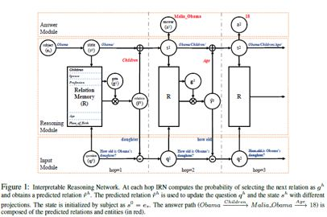

## 一种用于多关系问答的可解释推理网络

> 论文笔记整理：谭亦鸣，东南大学博士生，研究方向为跨语言知识图谱问答。

来源：COLING 2018

链接：https://www.aclweb.org/anthology/C18-1171

 

## **问题背景与动机**

多关系问答（multi-relationquestion answering）是知识问答的一个重要任务，“多关系”指的是问题中包含多个关系和实体信息，为了回答这类问题，需要对知识库中多个事实三元组进行分析和推理。

 

现有的方法主要可以分为两类：基于语义分析；基于embedding；

 

基于语义分析的方法主要依赖于人工特征与标注，但是泛化能力较弱。

基于embedding的方法一般利用弱监督机制训练得到end-to-end问答模型，但是现有的方法主要依赖于相似度计算而在推理方面有所欠缺。

 

在这篇文章中，作者提出‘可解释推理网络（Interpretable Reason Network，IRN）模型’用于解决多关系问答。通过多跳推理的形式完成多关系问题的问答过程。

 

## **贡献**

1. 提出面向多关系问答的IRN模型，并在性能上取得了state-of-art

2. 相对于现有推理网络，这篇文章提出的方法更具可解释性，多跳推理的过程可以清晰的反映答案生成的过程

## **模型**

 

IRN的整体框架如图所示，其中包含三个子模型：Input Module; ReasoningModule; Answer Module，分别用于问句的embedding，三元组推理以及答案的生成。

以问题‘Howold is Obama’s daughter?’ 为例，问题的解析、推理和回答过程包含三跳(3 hops)，每个hop包含的过程相同，描述如下：

1. Input Module：输入问题(仅初始)，得到问题的embedding形式q
2. Reasoning Module：输入q，以及对问题NER得到的实体信息e1，找到对应的关系r1
3. Input Module：将已识别关系信息r1从q中去除，得到更新的q’，用于下一步推理
4. Answer Module：根据已得到的e1和r1从知识库中找到对应的答案信息
5. Reasoning Module：将已分析实体信息e1与关系信息r1融合，并用于下一步推理

其中，获取关系r的计算过程如以下公式所示：

## **实验**

**实验数据**

本文实验所使用的数据基于WorldCup2014，数据集的统计信息由表1所示。

 

**实验结果**

对比模型说明：

1. Embed (Bordes et al., 2014b)：利用embedding空间将问题和答案进行匹配的方法

2. Subgraph (Bordes et al., 2014a)：在Embed基础上利用实体子图加强答案实体的表达

3. Seq2Seq (Sutskever et al., 2014)：使用基于LSTM的encoder-decoder实现的语义解析模型

4. MemN2N (Sukhbaatar et al., 2015)：使用记忆网络构建的end2end模型，其中记忆单元包含了相关的三元组信息

5. KVMemN2N (Miller et al., 2016)：在MemN2N的基础上，将记忆单元划分为键-值两个部分，键为头实体及关系，值为尾实体

6. IRN-weak (This paper)

**可解释性分析**

表3反映了IRN在多跳过程中识别关系和实体的精准度，r1/e1 -&gt; rn/en -&gt; a

