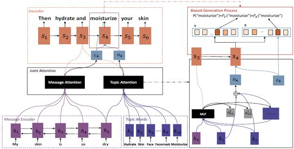
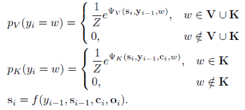

## 主题感知的问答生成

&gt; 笔记整理: 

**Citation: XingC, Wu W, Wu Y, et al. Topic aware neural response generation[C]//Thirty-FirstAAAI Conference on Artificial Intelligence. 2017.**

## 

## **动机**

人机对话在 AI 和 NLP 领域是一项具有挑战性的工作。现存的对话系统包括任务导向的对话系统和非任务导向的聊天机器人。在聊天机器人里面构建对话引擎的方法就是利用大规模的社会对话数据，在机器翻译框架里学习一个回答生成模型。最近，基于方法的神经网络成为主流趋势，因为它们可以抓住输入文本和回答之间的语义和语法关系。但是，聊天机器人的回答生成算法不仅要生成自然流利的回答，还要生成具有信息量的，有趣的回答。但是现存的机器翻译模型比如带注意力机制的 Seq2Seq 倾向于生成一些无意义的回答，比如“Me too”“I see”等。这种回答十分无聊也不含有任何有用的信息，很容易结束人机对话。

因此，为了生成有趣的富含信息量的回答，使人们不觉得与机器对话无聊。作者提出了一个 topic aware sequence-to-sequence  (TA-Seq2Seq) 模型，利用话题信息作为作为先验知识，生成回答。给定一个输入信息，作者预测了可能会在回答中谈论到的话题，然后生成针对该话题的回应。这个想法是作者观察人们之间的交流而想到的。在人与人之间的交谈中，人们经常会将输入的信息与心中的话题相关概念联系起来。基于这些概念，人们组织内容并选取作为回答的单词。TA-Seq2Seq 是基于 sequence-to-sequence 框架构建的。在编码时，通过信息编码器将输入信息表示成隐向量，从预训练好的 Twitter LDA 模型得到输入信息的主题单词。使用对话数据之外的大规模社会数据集预先训练 Twitter LDA 模型。在解码阶段，通过联合注意机制，根据输入信息和话题，生成每个单词。联合注意机制，就是将输入信息的隐藏向量通过现有的 attention 机制表示成语境向量，然后将话题单词的 embeddings 通过话题注意机制合成为话题向量。与现存的注意不同，为了加强话题和输入信息的联系，话题注意会额外输入输入信息的最终状态，计算话题单词的权重。

## 

## **贡献**

文章的贡献有：

（1）     提出使用主题信息作为先验知识，辅助生成回答。

（2）     提出了TA-Seq2Seq模型，该模型将主题信息融入编码器—解码器结构中。

（3）     验证了TA-Seq2Seq模型的有效性。

## 

## **方法**

**（****1）sequence-to-sequence 注意力模型******

这是作者的baseline模型。在Seq2Seq 中，给定原文本（message）X=(x_1,x_2,…,x_T)，和一个目标文本（response）Y=(y_1,y_2,…,y_T')，该模型最大化以X为条件的生成概率Y：。特别的，Seq2Seq 是一个 encoder-decoder 框架。encoder 一个单词一个单词的读入X，通过循环神经网络将它表示成一个语境向量c，然后decoder 以 c 作为输入，计算 Y 的生成概率。如下所示：

编码器的循环神经网络通过以下公式计算文本向量c:

其中，h_t 是 t 时间步的隐含状态。f 是一个非线性变化，要么是LSTM 单元，要么是GRU 单元。本篇文章中，作者使用了GRU 单元表示f，如下所示：

decoder 是一个标准的 RNN 语言模型。每个时间步 t 时，对候选单词的概率分布 P_t 的计算公式如下：

其中，s_t 是decoder RNN 在时间步t 的隐向量， y_(t-1) 是时间步 t-1 时生成的单词。

**（****2）Attention 机制******

标准的Seq2Seq 模型假定每个单词都是由同一个语境向量生成的。但是，实际上，Y 中不同的单词在语义上与X 中的不同部分相关。为了解决这个问题，人们就在 Seq2Seq 中加入了 attention 机制。在基于注意力的Seq2Seq 中，每个 **y_i** 都与一个语境向量 c_i 相关， c_i 是编码器所有隐藏向量的加权平均值。c_i 的常规定义如下：

其中，\eta 是激活函数，通常使用 tanh 表示。

**（****3）TopicAware Seq2Seq 模型******

这是作者提出基于上述模型改进得到的新模型，引入了输入信息X 的话题单词集K。作者的目标就是该模型能够根据输入信息X 和它的话题单词K，生成回答Y。

**获得话题单词******

作者使用了Twitter LDA 模型从文本中得到话题单词。该模型就是假设每个message 只与一个话题相关，message 中的单词要么是背景单词，要么是话题单词。作者使用折叠的 Gibbs 采样算法估算了 Twitter LDA 的参数。之后，作者使用模型将主题 z 分配给 message X，在 z 下选择具有最高概率的前 n 个单词，并删除诸如“thank”和“you”之类的通用单词，得到message X 的主题词 K。在学习过程中，作者需要得到每个主题词的矢量表示。为此，我们首先通过等式计算主题词 w 的分布，其中 C_{wz} 是在训练中将 w 分配给主题 z 的次数。然后，我们将该分布作为主题词的向量表示。

作者在实验时，使用从新浪微博得到的大规模数据训练Twitter LDA 模型。除了用于训练回答生成模型的message-response对中的数据之外，该数据还提供了话题知识。这个过程类似于人们学会在对话中做出回应的过程：他们开始意识到可以从互联网上谈论什么，特别是从社交媒体，然后使用他们学到的东西作为话题，在对话中形成他们的回答。

**模型******

下图是作者的 TA-Seq2Seq 模型架构图。

图1：Topic aware sequence-to-sequence 模型架构图

基于上述 attention 机制和 sequence-to-sequence 模型的基础上，在编码阶段，作者额外加入了message X 的话题单词K。使用topic encoder 编码K 中单词的embedding。在解码阶段，在时间步i，message 向量被转换成一个语境向量 **c_****i**，话题单词 的 embedding 通过 topic attention 被线性结合成话题向量。公式如下：

其中，**s_{i-1}** 是解码器中第 i-1 步的隐状态，**h_T** 是输入信息的最终隐状态，是多层感知机。与传统的 attention 相比，topic attention 利用了输入信息的最终状态来弱化与信息无关的话题对生成回答的影响，并强调了与信息相关的话题的重要性。message attention 和 topic attention 形成了联合注意力机制，使得 **c_i** 和 **o_i** 共同影响生成概率。共同注意力优点在于它不仅可以使生成的回答中的单词与输入 message 相关，还可以与 message 的话题相关。

作者定义生成概率，其中， 和 定义如下：

其中，V是回答的词汇表，f是GRU单元。和 定义如下：

其中，是tanh，w 是单词 ω 的 one-hot 指示向量，都是参数。用来归一化。

TA-Seq2Seq 的另一个优点就是在生成回答时，生成的第一个单词更正确。第一个单词很重要，因为它是整个句子的开头。以往的Seq2Seq 的第一个单词生成，仅仅依靠 **c_0**，因为当 i = 0 时，没有 s_{i-1}，但是在TA-Seq2Seq中，不仅 **<em>c_0** </em>决定了第一个单词的生成，而且 **o_0**（与话题信息相关）也贡献了一部分。这种方法提高了生成的第一个单词的正确性。

## 

## **总结******

这篇文章提出了一个Topic awaresequence-to-sequence（TA-Seq2Seq）模型，将话题信息融合到回答生成中。该模型通过联合注意机制和偏向生成概率来利用主题信息。实验证明，该模型能够生成含有有效信息的、风格多样的回答。

**OpenKG**

开放知识图谱（简称 OpenKG）旨在促进中文知识图谱数据的开放与互联，促进知识图谱和语义技术的普及和广泛应用。

点击**阅读原文**，进入 OpenKG 博客。
