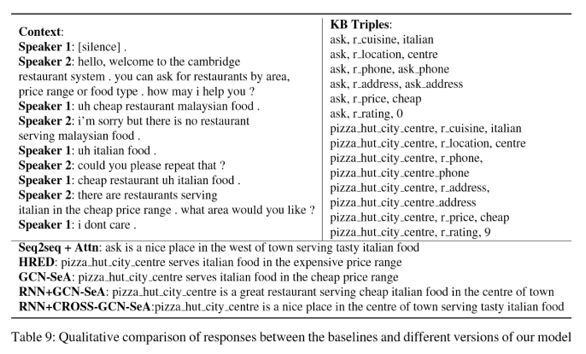
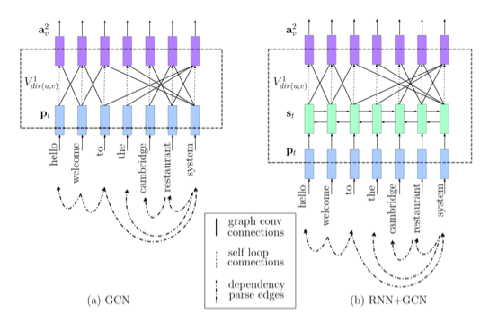
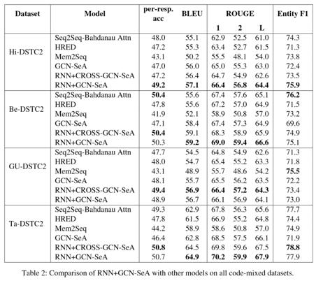
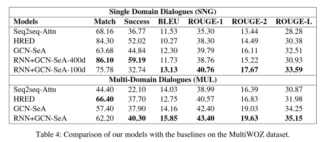
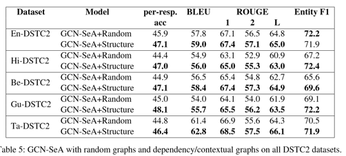
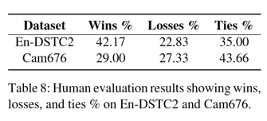

## 具有图卷积网络和顺序注意力机制的应用于目标导向的对话系统

> 论文笔记整理：吴涵，天津大学硕士，研究方向：自然语言处理。

> 来源：2019 Association for Computational Linguistics论文链接：https://www.mitpressjournals.org/doi/full/10.1162/tacl_a_00284开放源码：https://github.com/sumanbanerjee1/GCN-SeA

### 概述

面向特定领域的面向目标的对话系统通常需要对三种类型的输入进行建模，即，（i）与该域相关联的知识库，（ii）对话的历史，这是一系列话语，以及（iii）需要为其生成响应的当前话语。本文提出了一种面向目标的对话的增强记忆GCN。该模型利用（i）知识库中的实体关系图和（ii）与话语关联的依存关系图来计算单词和实体的更丰富表示形式。此外，在某些情况下，例如当对话使用代码混合语言时，依赖解析器可能不可用。在这种情况下，我们从整个语料库构造了一个共现矩阵，并使用该矩阵将图结构强加于单词上。更具体地说，如果在句子中两个词经常同时出现，我们会在句子中的两个词之间添加一个边。我们的实验表明，这种简单的策略可以合理地替代依存关系分析树。

### 模型和方法

每个t轮的对话都可以看作是用户话语（U）和系统响应（S）的连续显示，并且可以表示为：(U1,S1,U2,S2,...,U
 t,S t)。除对话外，每个对话还伴随着与该对话相关的e个 
KB（知识库）三元组，可以表示为：(k1,k2,k3,...,ke)。每个三元组都是这种形式：(entity1,relation,entity2)。在任何第i轮对话：给出：（1）    dialogue history H =( U1, S1, U2, ..., S i−1),（2）    the current user utterance as the query Q = Ui（3）    the associated knowledge graph Gk目标：生成Si。利用知识库中的图结构和话语中的句法结构来生成适当的响应，提出以下模型：

### 1. Query Encoder

查询Q = Ui是对话中的第i个（当前）用户话语，包含| Q |个标记。我们将第i个标记在查询中的嵌入表示为qi。我们首先通过将这些标记传递给双向RNN来计算这些标记的上下文表示：

注：双向RNN假设当前t的输出不仅与之前序列有关，还与之后的序列有关。

现在，考虑由图G表示的查询语句的依存关系分析树，我们使用特定于查询的GCN对GQ进行操作。把 作为第一层GCN的输入

查询特定GCN的第k跳中的节点表示形式计算如下：

W、g：第k跳边缘指定方向的查询-GCN的权重和偏差。其中：

### 2. Dialogue History Encoder

对话的history H包含| H |个标记，我们用pi表示第i个标记在历史中的嵌入。再次，我们首先使用双向RNN计算这些标记的隐藏表示形式：

现在，我们为历史记录中的每个句子计算一个依存关系分析树，并将所有树共同表示为一个图G。此图将仅包含属于同一句子的单词之间的边，并且跨句子的单词之间没有边。然后，我们使用特定历史的GCN对这个图G进行操作，该操作将St作为第一层的输入。历史特定GCN的第k跳中的节点表示形式计算如下：

V、o: 特定于边缘方向的历史-第k跳中的GCN权重和偏差

### 3. KB Encoder

Gk是描述与对话相关的知识图中实体之间的关系的图。假设有m个这样的实体，我们将对应于第i个实体的节点的嵌入表示为ei。然后，我们运行特定于知识库的GCN。特定于KB的GCN的第k跳中的节点表示为：

与句法GCN的情况类似，我们还向EK添加了逆边缘，以便允许信息在知识图中的实体对的两个方向上都流动。

### 4. Sequential Attention

我们使用RNN解码器生成响应的标记，并将解码器的隐藏状态表示为：

其中：T是总共的解码器时间步长 

为了从查询GCN的最终层（k = f）获得节点向量的单个表示形式，我们使用下面的Attention机制：

其中：V、W1、W2都是参数。此外：在每一次解码循环中，我们会根据查询上下文向量 计算历史中每个节点/标记的注意力得分，从而从history-GCN的最后一层获取查询感知表示。其中：

其中：V2、W3、W4、W5是参数。最后，我们通过使用下面的和 计算KB-GCN的最后一层中所有节点的注意力得分来获得知识库的查询和历史记录表示

### 5. Decoder

a. 解码器的两个条件：（1）包含history和KB的上下文（2）对话中最后/前一个话语的查询b. 我们使用一个聚合器来学习对历史和KB组件的整体关注。这些注意力得分：θHt和θKt取决于相应的上下文向量和先前的解码器状态dt-1。最终上下文向量的获取方式为：

在每个时间步，解码器都会使用以下公式计算词汇表上的概率分布：

其中：Wt: 第t时间步的解码器输入。V’和b’: 参数。Pvocab: 整个词表的概率分布
时间步t的损失:  ，其中Wt*是真实回答的第t个字。总损失：每个时间步损失的平均值。

### 6. Contextual Graph Creation

于对话历史记录和查询编码器，我们使用依赖关系分析树来捕获编码中的结构信息。但是，如果对话以语言显示，则不存在依赖关系解析器，那么我们需要一种从话语中提取图形结构的替代方法。

在上下文语境是整个句子时，一个可行的简单方案是创建一个词共现矩阵。一旦有了这样的共现矩阵，对于给定的句子，如果两个单词的共现频率高于阈值，则可以在两个单词之间连接边。

词共现矩阵可以包含共现频率计数或正向PMI值（衡量两个事物的相关性）。

### 实验数据集

（1）经过修改的Bordes的DSTC2数据集。基于饭店餐桌预订的任务，并包含人类与机器人之间真实对话的文字记录。删除对话状态注释，并且仅存在原始话语-响应对以及每个对话的一组相关的KB三元组。（2）由Banerjee最近发布的修改的DSTC2的代码混合版本，它通过以四种语言将修改后的DSTC2（En-DSTC2）的英语版本的语音代码混合在一起来收集此数据集：Hindi
 (Hi-DSTC2), Bengali (Be-DSTC2), Gujarati (Gu-DSTC2), and Tamil 
(Ta-DSTC2)。（3）对两个目标导向的对话数据集进行了实验，这些数据集包含人类之间的对话，其中对话以Oz向导（WOZ）的方式收集。（4）Cam676数据集（Wen等，2017），其中包含来自餐厅领域的676 KB-grounded对话以及MultiWOZ（Budzianowski等，2018）数据集，其中包含10438个对话。

### 实验结果

所有代码混合语言上，我们的模型均优于基准模型。从所有语言的结果中得出的一个普遍观察结果是，RNN + GCN-SeA的性能优于GCN-SeA。

BLEU和ROUGE得分表明，我们模型的响应更加流畅。它也根据对话目标产生正确的实体，但未能提供足够的可请求位置。

在MUL上，模型能够产生流畅的响应，但由于多个域的复杂性增加，因此难以提供正确的实体。但是，由成功率可以看出，模型仍然提供了大量正确的可请求插槽位。这是因为多个域(hotel,
 restaurant, attraction, hospital)具有相同的可请求插槽位(address,phone,postcode)。

所有语言在GCN-SeA + Random方面的性能下降。这表明依赖关系和上下文结构起着重要作用，不能被随机图代替。

RNN-Bahdanau的注意力机制要比GCN-Bahdanau的注意力机制要好。

在自发对话的嘈杂环境中，例如DSTC2数据集中显示的那些，我们的模型响应是有利的。但是，在用于人与人对话的WOZ环境中，对话的自发性较低。

### 总结

作者证明了具有结构意识的表示形式在面向目标的对话中很有用，并且得到的模型优于四个对话数据集上的现有方法。除使用GCN注入依赖关系图和上下文图的结构信息，以丰富对话上下文和KB的表示形式。还提出了一种顺序注意力机制来结合：（1）当前查询 （2）会话历史 （3）KB

最后，作者凭经验表明，当依赖解析器不适用于某些语言（例如代码混合语言）时，则可以使用词频出现频率和PPMI值 提取上下文图并将其与GCN配合使用以提高性能。

