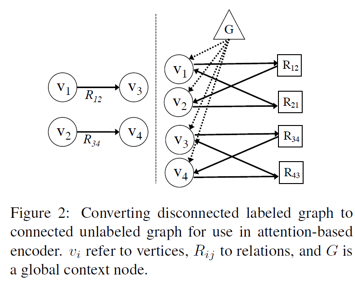
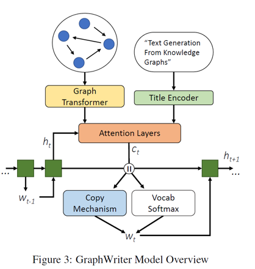
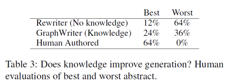
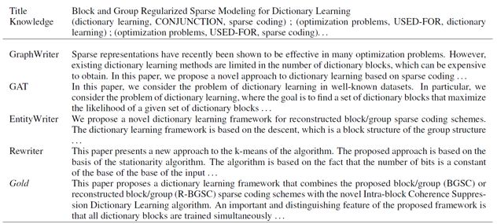
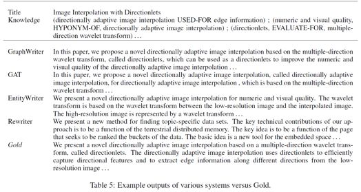

## 利用图 Transformer 实现基于知识图谱的文本生成

> 论文笔记整理：谭亦鸣，东南大学博士生，研究方向为跨语言知识图谱问答。

> 来源：NAACL2019

> 链接：https://arxiv.org/pdf/1904.02342.pdf

 
本文关注如何从信息抽取结果（特别是知识图谱）出发，生成连贯的多句文本。作者表示图谱化的知识表示在计算中普遍存在，但由于其非层次，长距离依赖，结构多样等特性，使得基于图谱的文本生成成为一个巨大的挑战。

 

## **动机**

为了摆脱图谱表示学习过程需要添加的线性/层次约束，有效利用起图谱中的关系结构，作者提出一种新的Graph Transformer编码器。

 

## **贡献**

1.    提出了一种Graph Transformer编码方法用于知识图谱表示学习

2.    提出一种将IE输出转换为图结构用于编码的过程

3.    构建了一个可复用的大型“图谱-文本”对数据集

 

## **方法**

**Graph Transformer**

**预先准备**为了进行编码，作者将图谱重构为一种无标注的连接图，实体和关系都为图中的节点，下图左为一般的知识图谱三元组形式，右边为重构的图结构。可以看到，每个三元组都被替换为两个“实体-&gt;关系/关系-&gt;实体”的有向图，同时为了保留未连接实体之间的信息流（information flow），作者设置了一个全局结点G指向所有的实体节点。

最终得到的是一个全连接，无标注的图G = (V, E)，其中V表示图中所有节点的列表（实体，关系，全局节点），E则是表示图中各条边的方向的邻接矩阵。

           

**Transformer**** 模型**本文模型与图注意力网络（GAT）的思路相近，利用注意力机制，将相邻节点的信息用于生成目标节点的隐状态表示。但是GAT模型仅考虑图谱中已出现相邻节点的信息，本文提出的全局节点设定使得模型能够利用更为全局的信息（可能存在的实体关联，但并未出现在知识子图中的潜在信息）

下图是graph transformer模型的框架图，结构上与普遍使用的transformer模型并无明显区别，本文不再赘述。

Graph Attention的计算由各head的输入加权拼接实现，过程如下：

**End2End****文本生成模型**

End2End 文本生成整体上还是由编码和解码两个部分构成（如下图），其中，编码结果由两个编码输入整合得到，分别为图谱编码（来自 graph transformer）与主题/标题（Title）编码（来自biRNN）。个人理解，主题编码的目的是给多句文本的生成提供一个顺序指导，假设多句连贯文本本质上是一条一套三元组构成的路径，主题编码则是表示路径的起点，以及生成过程必须经过的某些节点。

解码部分则是由一个单向的RNN构成，生成序列的过程除了从词表中选词的softmax方式外，还添加了复制机制，这一做法可以避免低置信度文本生成（以及OOV情况）。

## **实验**

**数据说明：**

本文实验所使用的训练数据来自AGENDA（Abstract Generation Dataset，摘要生成数据集，科技论文领域），作者利用SciIE信息抽取系统，将摘要中的实体/关系识别出来，作为节点构建知识图谱，过程如下图所示。

AGENDA数据集的相关统计参数如下图所示，作者将数据集切分为38720规模的训练集，1000验证集与1000测试集

** **

**实验方案：**

作者考虑了人工评价与自动评价两种评测机制，自动评价方法选择了常见的BLEU与METEOR，用于反映生成文本相对参考文本的n元文法相似程度，对比系统与结果如下表所示。

人工评价方面，则通过投票，对候选系统的输出结果进行投票，可以看到本文方法在best评价的获取数量是Rewriter（未引入知识图谱的方法）的两倍，可以说，图谱化的知识相对非结构化文本提供了更清晰的知识结构。

更为直观的是一些生成样例，如下图所示：

## **思考**

    本文使用的图谱由文本中的信息抽取构造而成，并不是对现有知识图谱的应用，这一做法避免了图谱中实体/关系节点表示形式与自然语言表达差异性带来的影响，是一种“文本-&gt;图谱-&gt;文本”的过程，图谱中节点的表达都明显倾向自然语言。换言之，这种图谱结构的稳定性（歧义性）是需要讨论的，此外，本方法直接用于已有图谱（如DBpedia，YAGO）到文本的生成，则需要解决实体关系描述倾向非自然语言的情况。

 