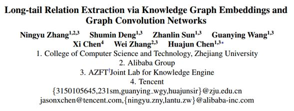
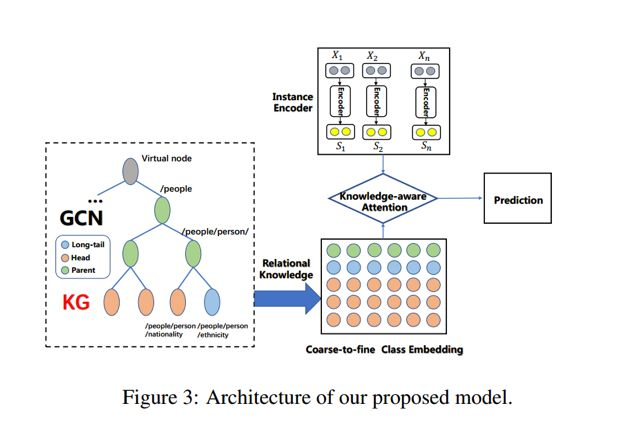
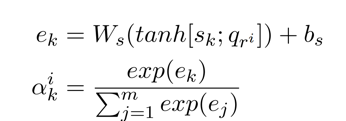
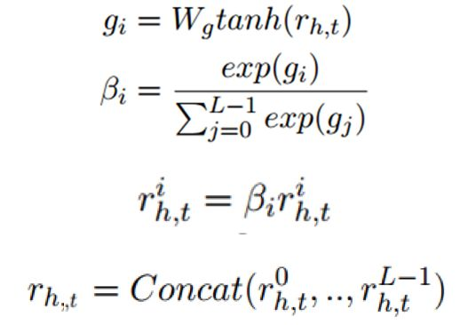
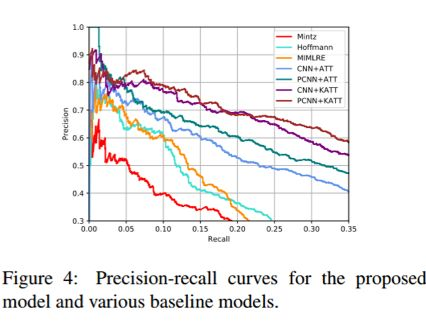
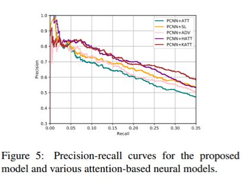
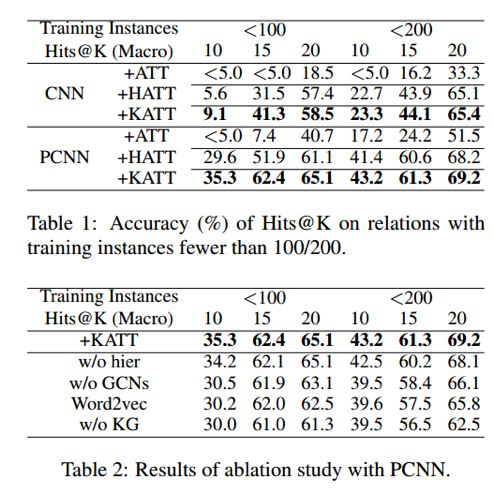

## 利用知识图谱嵌入和图卷积网络进行长尾关系抽取

> 论文笔记整理：王狄烽，南京大学硕士，研究方向为关系抽取、知识库补全。****

链接：https://arxiv.org/pdf/1903.01306.pdf

发表会议：NAACL2019

## 

## **动机**

现有的利用远程监督进行实体关系抽取的方法大多关注于如何对训练数据进行降噪，从而提升模型效果，而忽略了长尾关系的抽取，使得长尾关系抽取效果极差。但是长尾关系的存在是不可忽略的，在NYT数据集中，大约70%的关系属于长尾关系（即该关系训练实例数量较少，少于1000）。如何提高模型对长尾关系抽取效果是该篇论文主要出发点。

## 

## **贡献**

该篇论文的主要贡献如下：

1、提出了一种长尾关系远程监督抽取的模型；

2、联合使用KG embeddings 和 GCNs 来学习关系丰富的语义信息；

3、利用coarse-to-fine knowledge-aware mechanism 来利用关系语义信息；

4、在NYT数据集上的结果表明当前模型在长尾关系的抽取上取得了state-of-the-art的效果。

## 

## **方法**

在方法整体思路上，遵从前人工作，利用语义相近的head关系，辅助训练长尾关系，从而缩小关系抽取时潜在的搜索空间、减少关系之间的不确定性。该思路的两个要点在于：1、如何学习得到关系语义信息；2、如何利用学习得到的关系语义信息。

对于如何学习得到关系语义信息，该论文首先利用现有的KG embeddings方法（如TransE等）学习得到关系的隐式语义信息，但是因为TransE等模型无法有效建模关系的一对多、多对多情况，从而仅仅通过KG embedding方法无法有效获取关系的语义信息。因此，论文中使用图卷积网络（GCNs）从关系的层次结构中获取关系的显式语义信息。最后将关系的隐式语义信息和显式语义信息进行结合从而得到最终的关系语义信息表示。

对于如何利用学习得到的关系语义信息，该论文首先利用CNN将句子编码为低维向量，然后使用 coarse-to-fine knowledge-aware mechanism 从多个同实体对句子（多实例学习）加权得到最终的句子向量表示。

模型的框架图如下所示：

从模型框架图中可以看出，其方法主要包含三个部分：

1、实例编码模块：利用CNNs对句子进行编码；

2、关系知识学习模块：利用KG embedding和GCNs得到关系的语义表示；

3、Knowledge-aware注意力模块：利用关系语义信息对同实体对的多个句子进行加权得到最终句子的语义表示。

**1、实例编码模块******

** **给定一个句子及其包含的两个entity mentions，利用CNN或PCNN模型，将原始的句子 ****s ****映射到一个低维连续空间中，得到向量****x****，该论文使用的特征包括1、预训练Skip-Gram word embedding；2、position embeddings。

** ******

**2、关系知识学习模块******

在关系知识学习中，综合利用 KG embedding 和 GCNs 得到关系的语义表示。对于KG embedding 使用 TransE 对知识进行预训练从而得到关系的隐式表示。

对于如何使用GCNs得到关系的显示表示？论文中首先构建了关系的层次结构图，关系的层次结构图可以使用hierarchy clustering (Johnson, 1967) or K-means算法结构构建，也可以使用现有知识图谱中关系的层次结构。关系的层次结构图如下所示。

对于构建的关系层次结构图，底部的节点用TransE预训练的关系向量进行初始化，父节点初始化为子节点平均值。

使用两层GCN，对构建的关系层次图进行迭代训练，GCN 输出层公式如下：

最终关系的语义表示为：

**3、Knowledge-aware注意力模块******

依从多实例学习，对于给定的实体对，以及相关的多个句子，对于一个关系****r****，我们可以得到其关系的层次链，其中是的子关系。

我们计算 Attention 操作在关系层次链的每一层，从而得到每一层文本相关的关系表示，具体公式如下：

考虑到不同层次的关系对最终实例表示的贡献的不同，对每一层关系表示使用Attention操作,其中使用作为****score-function****,表示输入关系****r****和该层预测关系****r’****之间的匹配层度，计算公式如下：

最后使用来计算，计算公式如下：

## **实验**

**1、数据集******

****NYT dataset************

**Relations number******

**53******

**Training set******

**522611 sentences******

**281270 entity pair******

**18252 relation facts******

**Test set******

**172448 sentences******

**96678 entity pairs******

**1950 relation facts******

**2、实验结果**

****

****

****

**3、长尾关系实验结果******

说明：为了体现模型在长尾关系的有效性，作者选择了实例数少于100/200的长尾关系，以长尾关系构建测试子集进行实验，实验结果如下。

## **总结**

本文针对长尾关系抽取提出了一种利用KG embedding和GCNs学习关系知识以及使用注意力机制利用学习得到的关系语义信息的模型。

