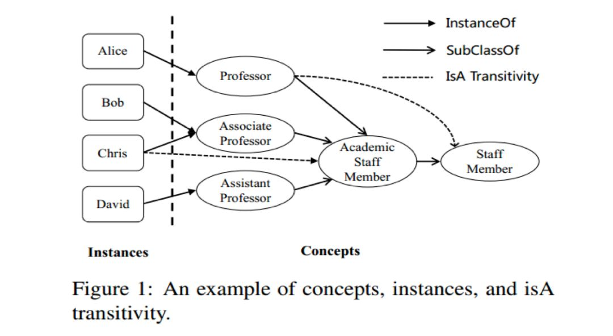
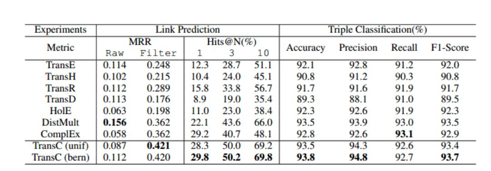

## 区分概念和实例的知识图谱嵌入方法

&gt; 笔记整理: 

链接：https://arxiv.org/pdf/1811.04588.pdf

 

知识图谱的表示学习最近几年被广泛研究，表示学习的结果对知识图谱补全和信息抽取都有很大帮助。本文提出了一种新的区分概念和实例的知识图谱表示学习方法，将上下位关系与普通的关系做了区分，可以很好的解决上下位关系的传递性问题，并且能够表示概念在空间中的层次与包含关系。本文的主要贡献有三点：（1）第一次提出并形式化了知识图谱嵌入过程中概念与实例区分的问题。（2）提出了一个新的嵌入模型TransC模型，该模型区分了概念与实例，并能处理isA关系的传递性。（3）基于YAGO新建了一个用于评估的数据集。

# **Background**

传统的表示学习方法没能区分概念（concept）和实例（instance）之间的区别，而是多数统一看作实体（entity），而概念显然和实例不是同一个层次的，统一的表示是有欠缺的。更重要的是，之前的方法多数无法解决上下位关系传递性的问题，这是不区分概念和实例表示的弊端。本文创造性的将概念表示为空间中的一个球体，实例为空间中的点，通过点和球体的空间包含关系和球体间的包含关系来表示上下位关系，这种表示可以很自然地解决上下位关系传递性的问题。下图是一个区分了概念，实例的层次关系图。

**Model******

通常在人们的脑海里，概念都是通过层级的方式组织起来的，而实例也应归属于与它们各自对应的概念，受此启发，本文提出了 TransC 模型来处理概念和实例区分的问题。在 TransC 模型里，每一个概念都被表示成一个球体，而每一个实例都被表示到与对应概念相同的语义空间中。概念与实例以及概念与概念之间的相对位置分别通过 instanceOf 关系与 subClassOf 关系来刻画。InstanceOf 关系用来表示某个实例是否在概念所表示的球体中，subClassOf 关系用来表示两个概念之间的相对位置，文中提出了四种可能的相对位置：

图1

如图1所示，（a）、（b）、（c）、（d）分别表示两个概念所表示球体的相对位置，其中m为球体半径，d 为两个球体中心的距离，Si 与 Sj 分别表示概念i与概念j所表示成的球体。对于 instanceOf 关系与 subClassOf 关系，文中有比较巧妙的设计以便保留 isA 关系的传递性，即 instanceOf-subClassOf 的传递性通过来体现，而 subClassOf-subClassOf 的传递性通过来体现，其中 **(i, r_e, c)** 表示InstanceOf三元组，**(c_i, r_c, c_j) **表示SubClassOf三元组。

文中设计了不同的损失函数去度量embedding空间中的相对位置，然后用基于翻译的模型将概念，实例以及关系联合起来进行学习。在文中主要有三类triple，所以分别定义了不同的损失函数。

    **InstanceOf Triple**表示：对于一个给定的 instanceOf triple，如果它是正确的，那么i就应该被包含在概念c所表示的球体s里。而实际上，除了被包含以外，很显然还有一种相对位置就是实例i在球体s（**P**,**m**）之外，损失函数设计为：

**    SubClassOf Triple**表示：对于一个给定的 subClassOf triple (**c_i, r_c, c_j**) ，首先定义两个球中心之间的距离：按照图1所示的四种关系，还有另外三种损失函数需要定义。（1）按照图1中（b）表示的相对位置，两个球是分开的，损失函数表示为：（2）两个球相交，如图1中（c）所示，损失函数表示为，与（1）类似。（3）完全包含关系，如图1中（d）所示，损失函数表示为：（减小mj，增大mi）

**    Relational Triple** 表示：对于一个relational triple (**h, r, t**) ，TransC利用TransE模型的训练方式来得到实体和关系的向量，所以损失函数定义为：

    对于模型的训练，分别用 和来表示正确和错误的三元组，根据以上几类损失函数，可以对应得到以下几类损失：

对于instanceOf triples，损失表示为，对于subClassOf triples，损失表示为，对于 relational triples，损失表示为，最后，模型的最终损失函数为以上几类损失的线性组合，即。

**Experiment******

以往的大多数模型都用FB15K和WN18来作为评估的数据集，但这两个数据集并不很适合文中的模型，而YAGO数据集不仅含了许多概念而且还有不少实例，所以作者构建了一个YAGO数据集的子集YAGO39K来用作试验评估。

实验分别在链接预测，三元组分类以及instanceOf与subClassOf关系的三元组分类这几项任务上进行，实验结果如下：

   链接预测与三元组分类结果：

instanceOf triple分类结果：

subClassOf triple分类结果：

实验结果表明，TransC模型在相关任务上与其它模型相比有较为显著的提升。

 

**Conclusion******

本文从Ontology层面对知识表示学习进行了较为深入的研究，提出了新的知识图谱嵌入模型TransC模型，该模型将实例、概念以及关系嵌入到同一个空间中以便用来处理isA关系的传递性。在实验部分，作者还创建了一个用来评估模型的新数据集YAGO39K。实验结果表明TransC模型在大多数任务上要优于传统的翻译模型。对于文中将概念表示成球体的想法似乎还可以继续探讨，作者将会继续寻找适合表示概念的方式。另外，每个概念在不同的三元组里可能会有不同的表示，如何进一步地将概念的多意性表达出来也是一个值得探究的方向。在传统的知识工程领域，知识是通过schema组织起来的，有较强的逻辑性，但在语义计算层面相比向量来说没有优势，最近有不少将二者相结合的工作（给语义的向量计算披上逻辑的外衣）值得关注一下。

 

论文笔记整理：张良，东南大学博士，研究方向为知识图谱，自然语言处理。

**OpenKG.CN**

中文开放知识图谱（简称OpenKG.CN）旨在促进中文知识图谱数据的开放与互联，促进知识图谱和语义技术的普及和广泛应用。

点击**阅读原文**，进入 OpenKG 博客。
