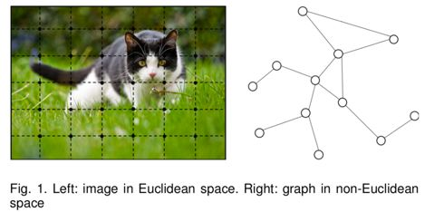
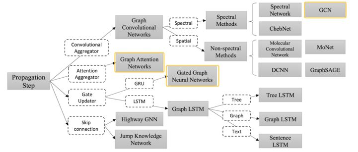
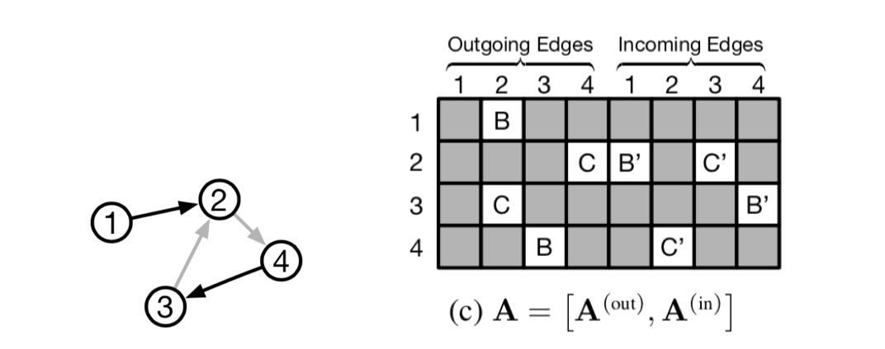
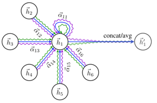
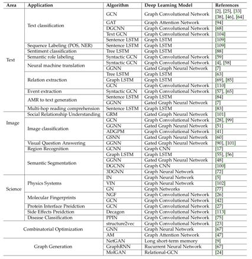
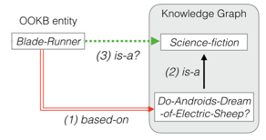
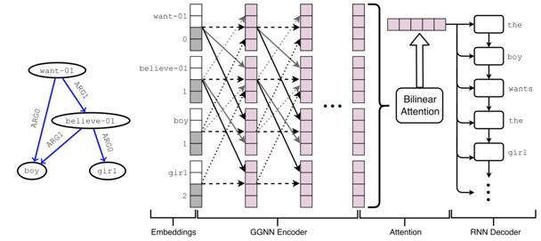
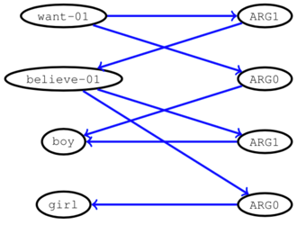

## 图神经网络综述：方法及应用

&gt; 笔记整理: 

论文链接：https://arxiv.org/pdf/1812.08434.pdf

GNN相关论文列表链接：https://github.com/thunlp/GNNPapers

 

近日，清华刘知远老师组在arXiv上发表了一篇关于图神经网络的综述，本次论文浅尝在分享这篇论文的基础上，对图神经网络的相关方法及应用作一次梳理。

**一、前言**

图神经网络(GraphNeural Networks, GNNs)，主要针对非欧几里得空间结构（图结构）的数据进行处理。具有以下特点：
- 忽略节点的输入顺序；- 在计算过程中，节点的表示受其周围邻居节点的影响，而图本身连接不变；- 图结构的表示，使得可以进行基于图的推理。

**二、图神经网络模型**

通常，图神经网络由两个模块组成：传播模块(PropagationModule)和输出模块(Output Module)，具体地：

（1）Propagation Module：图中节点之间传递信息并更新状态；
- aggregator: 对于一个节点**v**, 通过聚合其周围节点的信息，学习其潜在表示**h_v **(state embedding)。

其中，**x_v**为节点**v**的features，**x_co[v]**为其周围边的features，**h_ne[v]**表示节点**v**周围邻居节点的state embedding，**x_ne[v]**表示周围节点的features。
- updater: 更新节点的stateembedding。

（2）Output Module：基于节点和边的向量表示根据不同的任务定义目标函数

在监督学习场景中，对于一个特定的节点，其监督信号表示为：**t_v**，lossfunction定义为：

 

常见的图神经网络有：图卷积神经网络(GraphConvolutional Networks, GCNs)，门控图神经网络(Gated Graph Neural Networks,GGNNs)以及基于Attention机制的GraphAttention Networks(GAT)，下面详细介绍这三种网络：

 

1、图卷积神经网络（GCN）

（1）基于谱方法(Spectral Methods):

相关论文：&lt;ICLR-17&gt; Kipf T N, Welling M.Semi-supervised classification with graph convolutional networks.

      通过计算图拉普拉斯算子(Graph Laplacian)的特征分解，在Fourier域定义卷积计算。对于输入信号**x**和卷积核𝑔_𝜃=𝑑𝑖𝑎𝑔(𝜃):

其中，表示图结构的Graph Laplacian矩阵可分解为：

      上式的计算将卷积核近似为切比雪夫多项式，并进行化简：

最终得到GCN网络中的表示：
- aggregator:

- updater:

      但是以上方法有几点不足，卷积核的学习依赖图拉普拉斯矩阵的特征分解，对于图结构有一定的要求，在固定结构上学习的模型，无法迁移到其他结构的模型上。

 

（2）基于非谱方法(Non-spectral Methods):

在图上直接定义卷积计算，将不同size的邻居节点考虑在内，同时保持像CNN一样的局部卷积不变性。
- DCNNs：基于扩散卷积的思想的网络；- GraphSAGE：采样固定size的邻居节点，同时通过mean,LSTM, pooling等方式聚合周围节点的信息。

2、门控图神经网络（GGNN）

相关论文：&lt;ICLR-16&gt; Li Y, Tarlow D, Brockschmidt M,et al. Gated graph sequence neural networks.
- 提高图结构信息的long-term传播能力- 将图中的edge信息考虑在内
   将图矩阵作如下表示，不同类型的边采用不同类型的传播矩阵，同时，用 A^(out)和 A^(in) 分别表示节点的入度信息和出度信息。

     

计算图传播信息：

（1）Propagation module
- initialization step

- pass information：矩阵A中包含了当前节点与其他节点的交互信息

节点的state embedding h_{v^(t-1)}，与其他节点的交互信息a_{v^(t)}通过GRU单元进行融合：
- update gate

- reset gate

- activate

（2）Output module
- node-level

- graph-level

            其中，i,j表示两个全连接神经网络。

 

3、注意力图神经网络（GAT）

相关论文：&lt;ICLR-18&gt; Velickovic, Petar, et al. Graphattention networks.
- 为节点的不同的邻居节点指定不同权重- 节点-邻居节点对的计算可并行化，相比于GCN等网络，速度较快

       节点权重的计算：

       节点信息的更新：

      由“Attentionis all you need”一文中提出的head attention，GAT网络中也使用了headattention：

 

**三、图神经网络应用**

1、Structural Scenarios

主要应用于其数据结构为图结构的场景，如蛋白质分子结构图、KnowledgeGraph等。

以KnowledgeGraph中应用GNN为例：

 

相关论文：&lt;IJCAI-17&gt; Hamaguchi T, et al. Knowledgetransfer for out-of-knowledge-base entities: a graph neural network approach.

      论文主要针对KG中的out-of-knowledge-base(OOKB)实体，进行知识库补全等任务。

a、OOKB实体定义：

在训练过程中未被训练到的实体，无法得到其embedding表示，从而无法预测其与知识库中其他实体之间的关系。如下图中在测试期间新出现的实体“Blade-Runner”，或者说新出现的三元组“(Blade-Runner,based-on, Do-Androids-Dream-of-Electric-Sheep?)”（图中红线所示部分）。

我们的任务则定义为：基于知识库中已存在的三元组（2）和当前新出现的三元组（1），预测当前新实体与知识库中其他实体之间的关系（即三元组3）。

同时，OOKB实体即哪些与知识库中已存在的实体直接相连的实体，基于此，可以通过知识库中现有的实体表示得到OOKB实体表示。

 

b、这篇文章利用GNN中节点表示的方式，对OOKB实体进行表示：

其中，T_head表示以OOKB实体为尾实体的三元组集合，T_tail表示以OOKB实体为头实体的三元组集合，通过其周围邻居的头尾实体对当前实体进行表示。

            T_head, T_tail分别表示聚合三元组信息的函数，论文中为batchnormalization function。

            经GNN传播的节点状态表示为：

c、模型的输出模块利用TransE等经典模型，进行知识库补全任务。

2、Non-structural Scenarios

主要应用于其数据结构为非图结构的场景，如图片、文本等。在此类场景中，应用GNN通常有两种方式：
- 利用具有图结构信息的外部资源，如KnowledgeGraph等；- 探索此类数据中隐含的图结构，如文本的句法数结构。
 

（1）图片相关任务：
- Image Classification, i.e., zero-shot, few-shot- Visual Reasoning, i.e., VQA- Semantic Segmentation
其中，图片分类任务零样本学习和少样本学习的相关论文有：
- Zero-shot recognition via semantic embeddings and knowledge graphs- Rethinking knowledge graph propagation for zero-shot learning- Multi-label zero-shot learning with structured knowledge graphs- The more you know: Using knowledge graphs forimage classification- Few-shot learning with graph neural networks
（2）NLP相关任务：
- Text Classification- Sequence Labeling- Neural machine translation- Relation Extraction- Event Extraction
 

以机器翻译的一篇论文为例，通过将sourcelanguage的句法结构图输 GNN 进行 encode，继而附加 Attention layer 和 decoder 层，输出 target language 序列。

 

相关论文：&lt;ACL-18&gt; Beck D, Haffari G, Cohn T.Graph-to-sequence learning using gated graph neural networks.

           

    这篇文章以“Graph tosequence”为要点，实验部分包括两个任务，其中一个是AMR图输出序列，另一个做syntax-aware的机器翻译任务。

     其中，AMR Graph为从句子的句法表示中抽象出来的语义表示语言，具体相似语义的句子有相同的AMR Graph。如下图左所示。

      模型在Seq2seq模型的基础上，以AMR graph为输入，通过GGNN网络进行encode，经过Attention层和RNNdecoder输出序列。GGNN encoder部分表示为：

其中， 表示当前节点与周围节点相连边的参数，l_e 表示不同边的类型。

     但随着Graph中边类型的增多，很容易引起参数爆炸的问题，因此，本文提出了一种融合Graph中edge信息的方式，即将edge转化为附加的节点(no labelled edges)。具体地，通过将Graph转化为对应的二分图。上图中的句法结构图对应的二分图如下所示：

由此，graph中的边的类型只有一种。

 

**四、****Open problems**

         图神经网络目前虽被广泛利用，但存在不少问题亟待解决：

（1）Shallowstructure：多层的图神经网络，可能会导致over-smoothing的问题，如GCN等网络，一些论文中也尝试用Skip connection的方式加以解决；

（2）Dynamicgraphs：GNN目前仅能处理一些静态图，对于实时增加/减少的节点和边则无法很好地处理；

（3）Non-structuralscenarios：在处理非图结构的数据时，希望利用其中内在的结构，而目前从raw data中生成graph的方法仍需改善；

（4）Scalability

 

**五、总结**

本文中总结了近年来常用的几种图神经网络模型，并就其应用场景进行了进一步的探讨。总的来说，图神经网络强大的计算能力，对图结构数据的友好处理，深受研究者们的喜爱，但其仍存在很多需要解决的问题，也是我们可以进一步研究的方向。

 

笔记整理：耿玉霞，浙江大学直博生。研究方向：知识图谱，零样本学习，自然语言处理等。

 

**OpenKG.CN**

中文开放知识图谱（简称OpenKG.CN）旨在促进中文知识图谱数据的开放与互联，促进知识图谱和语义技术的普及和广泛应用。

点击**阅读原文**，进入 OpenKG 博客。
