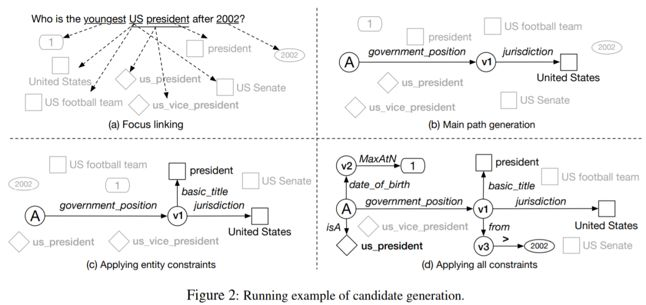
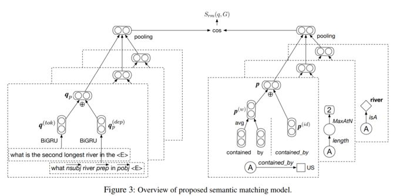
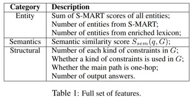
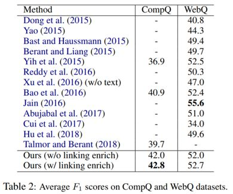
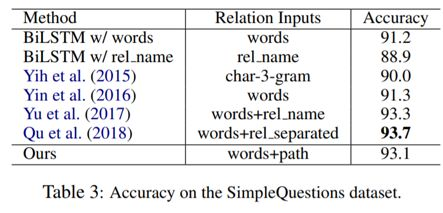

## 基于复杂查询图编码的知识库问答

> 论文笔记整理：谭亦鸣，东南大学博士生，研究方向为知识库问答。****

来源：EMNLP 2018

链接：https://www.aclweb.org/anthology/D18-1242

 

文章表示，复杂问答所面对的问题往往包含多种实体和关系（来自知识库），现有的知识库问答模型在复杂问答表现不足的主要原因在于无法同时表示问题本身以及对应的复杂查询结构，作者提出将复杂查询编码为统一的向量表示，这种方式成功捕捉到复杂问题中各语块之间的相互作用，实验表明这种方法在复杂问答上的优异性能以及在简单问答任务上的有效性。

 

**动机******

现有神经网络知识库问答模型在简单问答任务一般遵循以下框架：编码-对比，主要环节包括将问题与谓词序列编码为同一空间的语义向量，而后通过相似度计算实现谓词预测。当面对复杂问题时，直觉上需要将原始问题的复杂查询图（多个谓词序列）切分为子查询语块，再进行相似度计算。

作者认为这种方式存在两个明显的缺陷：1. 子语块无法与整个问题进行比较；2. 模型分别对各语块进行编码而忽略了查询图的整体语义信息

为了解决上述两个缺陷，作者提出一种改进的神经网络方法用于提升复杂问答中语义相似计算的准确性。

 

**贡献******

1.    提出一种轻量且有效的神经网络模型用于复杂问题解答

2.    在神经网络模型中添加问题依存解析结果用于强化问题的表示学习，并证明其有效性

3.    提出一种融合方法强化现有实体链接工具

4.    在多个问答数据集上验证了模型的有效性（包括简单问答和复杂问答）

 

**方法******

面向复杂问题的KBQA方法包含以下部分：

1.    候选查询图生成

2.    计算查询图与问题的语义相似性

3.    强化的实体链接

4.    训练和预测损失函数

 

**候选查询图生成：******

           

对于一个复杂问题来说，查询图的生成过程包含以下步骤，如图2所示：

1. Focuslinking（焦点链接）包含实体链接（S-MART工具实现），类型链接（抽取文本的1，2，3元文法，通过词嵌入相似性得到排名top 10的类型结果），时间链接（使用日期格式匹配得到），排序链接（构建最高级词表/序数+最高级模板）等四种；

2. MainPath Generation（主要路径生成）通过从答案节点出发连接到不同的焦点实体（通过谓词序列进行1跳或2跳），可以得到多个不同主要路径；

3. Applying entity constraint（实体约束），将实体链接节点添加到路径上；

4. Applying all constraint（其他约束），添加类型，时间，排序约束节点到路径中；

 ****

**语义相似度计算：******

           

基于神经网络的复杂问答语义匹配模型如图所示，步骤概括如下：

1.    首先，原始问题中的实体/时间均被替换为标识符&lt;**E**&gt;/&lt;**Tm**&gt;，并且得到其依存解析结果序列，分别使用BiGRU编码并相加融合得到其表示；

2.    为了编码复杂查询图，以答案节点为起始，对不同谓词路径进行切分，分别编码路径的谓词id及其自然语言描述，而后相加融合；

3.    计算问题编码结果与查询图编码结果的相似性，公式如下：

           

**强化的实体链接：******

**    **作者发现S-MART工具虽然在实体链接上具有非常优秀的准确性，但其召回率较低。为了解决这一问题，作者提出构建一个整合方法进行强化，首先从Wikipedia中收集所有的(mention, entity) pair集，其中每一组pair包含一系列的统计特征（链接概率，letter-tri-gram jaccard 相似性，popularity of the entity in Wikipedia等等），对于集合中能被S-MART找到的部分，利用一个两层的线性回归模型拟合其链接得分，从而训练模型用于预测每组pair的链接概率，提取其得到的Top-K样本强化S-MART的结果。

 

**模型训练和预测：******

**      **为了从候选查询图中识别出最优的结果，需要计算问题和每个查询图之间的全局联合得分（overall association score），这个得分由实体链接/语义匹配/结构等级等特征得分加权得到，具体特征如下表所示：

        训练过程考虑正负例共同构成的损失函数如下：

**实验**********

**数据集******

问答数据集：

1.  ComplexQuestions (Bao et al., 2016);

2.  WebQuestions (Berant et al., 2013);

3.  SimpleQuestions (Bordes et al., 2015);

知识库：

Freebase dump (host with Virtuoso engine)

 

**实验结果******

对于作者提出的End2End模型，在CompQ与WebQ数据集上的结果如下，评价指标为答案的平均F1值。可以看到，对于复杂问题的解答性能上，该模型相对其他方法有显著提升，在简单问答任务上，也展现出较为优秀的性能。

同时，模型在SimpleQ数据上的结果也取得了不错的性能。

** **

