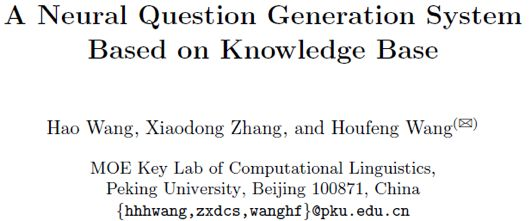
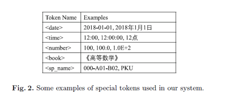
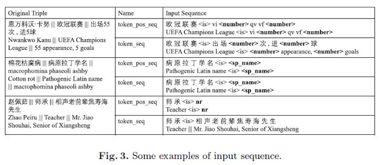
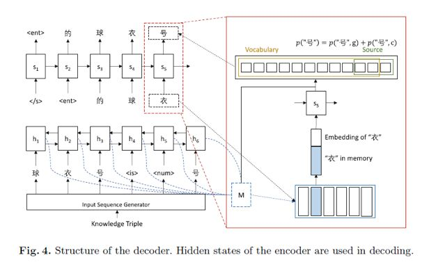
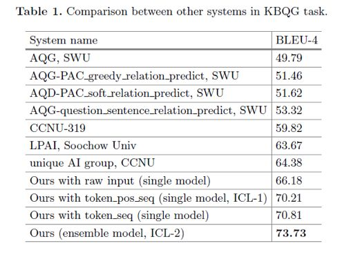

## 基于知识库的神经网络问题生成方法

> 论文笔记整理：谭亦鸣，东南大学博士生，研究方向为跨语言知识图谱问答。

> 来源：NLPCC2018

> 链接：http://tcci.ccf.org.cn/conference/2018/papers/EV7.pdf

 

## **问题背景与动机**

作者认为，目前的问题语料生成主要依赖于人工标注和整理，成本较大。而现有基于知识库的自动问题生成方法都不能较好的替代上述所需的人工标注效果。在同时考虑生成问题语料的流利度和问题的质量两个方面的问题后，采用了基于LSTM的神经网络生成方案，并提出一种新的输入序列预处理方式，从而达到获取高质量中文问题语料的效果。本方法在NLPCC2018的KBQG任务上获得了最优。

 

## **贡献**

1. 使用LSTM用于中文问题生成

2. 提出了一种新的输入序列处理方法

 

## **模型**

本文提出的模型由编码与解码两个部分组成，编码部分的输入是三元组（来自知识图谱）。

三元组由subject，relationship与object构成，作为答案的object在问题生成过程中不会被直接表达于问句中，但是它的存在有助于系统理解目前所生成问题的目标。因此，在问题生成过程中object需要被转换为一些特别的形式，以反映出它作为答案时，问句应表现出的问题意图类型。

下表是一些转换的例子，比如时间信息根据形式的不同可用&lt;date&gt;表示日期，&lt;time&gt;表示具体时间等等。

中文处理中一个非常难的问题是名称的识别，由于使用pattern无法有效找到中文名称信息，因此作者采用HanLP工具来完成上述工作，在HanLP中，名称信息可通过角色标注被识别出来。

这种object完成了上述两次替换的得到序列被作者称为token_seq，在完成名称识别后，则可以对原始三元组的object成分进行“词-&gt;词性标签“的替换（除了形容词和副词），如下表所示，经过这种替换的序列则被称为token_pos_seq。

需要说明的是，三元组中的subject会在输出序列中以&lt;ent&gt;的标签形式出现，因此不参与到问题生成模型的输入中，token_pos_seq/token_seq中的标签&lt;is&gt;用于分开relationship与object。

编码器-解码器的网络结构方面，采用了常见的双向LSTM编码与单RNN解码的形式完成。

## **实验**

文章的实验数据来自 NLPCC2018 的 KBQG 评测子任务，提供规模为24,479的问答训练集，测试集规模为357，评测指标选用了BLEU-4（较高的BLEU值表示模型生成的问题与标准问题的描述形式更为相近，但并不意味着低BLEU问题就是错误的，这里仅供参考）。

此外，详细的神经网络参数设置原文已由描述，这里不再赘述。

实验结果如下表所示。

