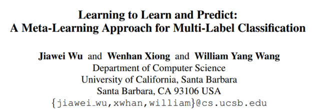
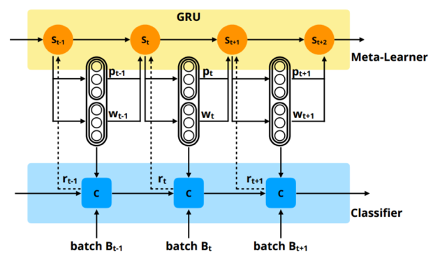

## 多标签分类中的元学习

&gt; 笔记整理: 

论文笔记整理：叶群，浙江大学计算机学院，知识图谱、NLP方向。****

会议：EMNLP 2019

链接：https://arxiv.org/abs/1909.04176

****

**Abstract**

这篇论文首次在多标签分类问题中提出了 meta-learning 的方法，学习weight policy 和 decision policy，分别指代训练时损失函数中不同标签的权重和预测时不同标签的阈值，从而更好地建模不同标签之间的依赖和复杂性。在实验表明在 entity typing 和 text classification 两个任务中都取得了更好的实验结果。

****

**Introduction**

     传统的多标签分类模型，在训练时采用标准的交叉熵损失函数，即每个类别的权重一致；在测试时，每个类别的阈值一般都取0.5。这种简单的设定忽略了标签之间的依赖关系，忽略了不同标签的重要性。实际中很多标签之间存在着关系，比如/organization和/company, /urban和/economics。本文利用meta learning的方法学习weight policy和decision policy，分别指代训练时损失函数中不同标签的权重和预测时不同标签的阈值。实际上权重和阈值可以被看做两个超参数，meta-learning学习到这两个超参数之后，传递给下游模型进行训练，所以本文的meta-learning方法是模型无关的。

****

**Method**

模型图如图1所示，基本结构分为两部分：meta-learner 和 classification model。Meta-learner的任务是学习 weight policy 和 decision policy，即权重和阈值两个超参；Classification model 根据学习到的两个超参，训练一个 Batch，并进行测试得到测试结果，并以测试结果作为 reward 去更新 meta-learner 和 classification model的参数。

图1 模型结构示意图

**Meta-learner**

    Meta-learner 的结构采用了 GRU，采用了强化学习的方法去进行weight policy和decision policy的学习。其中，强化学习的state是GRU的隐层表示：

Weight policy和decision policy的定义：

Reward的定义：

**Classification Model**

分类模型可以是任何形式的，只要损失函数是交叉熵形式即可，这里采用的损失函数为：

其中类别数为N，w为不同类别的权重。只训练一个Batch就进行测试，这样可以减轻训练的开销。

**Experiments**

      实验在entity typing和text classification两个任务上进行了评测。在entity typing上选取的数据集为FIGER、OntoNotes、BBN，分类模型采用了entity typing中的SOTA模型，其结构如下：

图2 entity typing模型结构示意图

实验结果如表1所示，加入weight policy和decision policy，模型的结果可以有2~3个百分点的提升。

表1 entity typing实验结果

      由于本文中 meta-learning 的方法是基于强化学习的框架，而强化学习通常缺乏鲁棒性和对初始化敏感。实验采用不同的初始化方法进行多次实验，结果如表2所示。

表2 模型鲁棒性实验

    文本分类任务模型选取了经典的 text CNN 模型，数据集有 Reuters-21578、RCV1-V2，实验结果如表3所示。

表3 文本分类实验结果

          模型的鲁棒性分析如表4所示。

表4 模型鲁棒性实验

 

**Conclusion**

       本文在多标签分类任务中，利用 meta-learning 的方法学习 weight policy和 decision policy，从而为不同标签学习到不同的权重和阈值，在entity typing 和文本分类两个任务上效果有所提升。但是针对作者所说的，可以建模不同标签之间的** dependency**，我觉得这一点上模型并没有显式地体现这一点。

**OpenKG**

开放知识图谱（简称 OpenKG）旨在促进中文知识图谱数据的开放与互联，促进知识图谱和语义技术的普及和广泛应用。

点击**阅读原文**，进入 OpenKG 博客。

********

