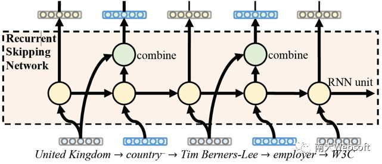
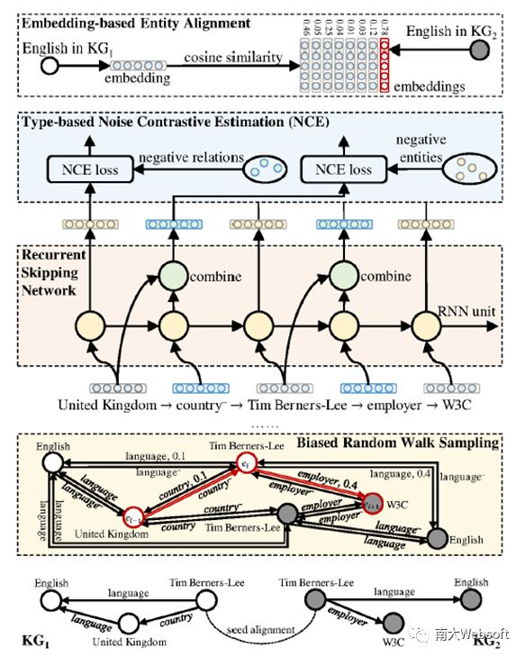
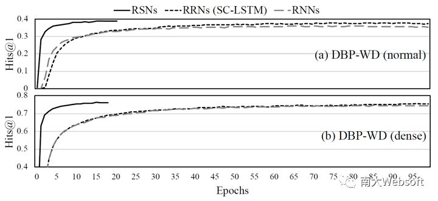
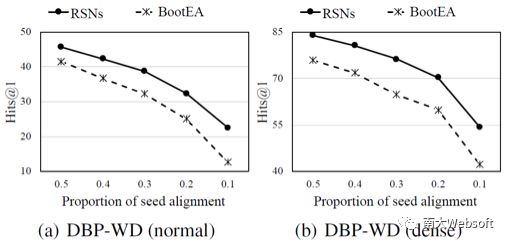

## 学习开发知识图谱中的长期关系依赖 - ICML 2019 ​

&gt; 笔记整理: 

本文转载自公众号：南大Websoft。  <mpchecktext></mpchecktext>

论文：https://arxiv.org/abs/1905.04914

代码：https://github.com/nju-websoft/RSN

**背景**

知识图谱结构化地存储着大量现实世界中的事实。其中，每个事实都以三元组 (**s**, **r**, **o**) 的方式进行描述，其中 **s**, **o** 分别表示头实体和尾实体，**r** 表示它们之间的关系。例如，三元组 (**Tim Berners-Lee**, **country**, **United Kingdom**) 描述了 **Tim Berners-Lee **的国籍为 **United Kingdom **这一事实。

 

通常情况下，单个知识图谱很难满足各类应用所需的全部知识。因此，知识图谱领域的学者们提出了两类相关任务：
- 实体对齐 (entity alignment)，其通过发现不同知识图谱中指称真实世界相同对象的实体的方式，将两个知识图谱链接起来，从而得到一个规模更大、信息更丰富的联合知识图谱。- 知识图谱补全 (knowledge graph completion)，其主要目的在于利用单个知识图谱中的已知信息，通过推理和预测的方式补全该知识图谱所缺失的三元组，譬如预测 (**Tim Berners-Lee**, **employer**, ?) 或 (?, **employer**, **W3C**) 中的 ?。
 

目前大多数知识图谱嵌入方法都假设相似的实体会拥有相近的关系，因此这些方法更关注知识图谱中的三元组，即一阶邻居关系。但是，基于三元组的学习方式存在两个局限性：一是表达能力低，这是因为这种方式只能从一阶邻居的视角来学习实体的嵌入表示，而知识图谱中存在着大量拥有类似一阶关系的实体，比如有相同的国籍、出生地等。二是语义信息传递效率低，这是因为这些方法只能依靠周围的一阶邻居传递语义信息，而一个实体嵌入所能包含的信息是有限的，这意味着并不能将所有的邻居信息完整地传递到周围。

 

相较于三元组，路径能够提供更长、更具区分性的实体间依赖关系，一条知识图谱路径可以用如下方式表示：

**United Kingdom**, **country**−, **Tim Berners-Lee**, **employer**, **W3C**

 

值得注意的是，目前已有的基于路径的知识图谱嵌入方法大多只采用由关系元素组成的路径，而不考虑路径中的实体。并且，由于它们是利用路径辅助三元组训练，因此往往需要穷解路径空间来寻找符合条件的路径，因此大多只考虑由两个三元组组成的路径。

 

**模型**

循环神经网络 (recurrent neural networks, RNNs) 只使用少量的参数就能处理任意长度的序列，而知识图谱路径恰好是有序的，因此可以利用 RNNs 来建模知识图谱路径：

               

其中，**W****h**, **W****x** 均为 **d **× **d** 的权重矩阵，**b** 为偏置向量。显然，该循环神经网络中的参数只有 **W****h**, **W****x**, **b** 三项，但能够建模任意长度的知识图谱路径。

 

值得注意的是，RNNs 无法识别出知识图谱路径中的三元组结构，包括：
- 路径中“实体-关系-实体-关系”交错的链式结构；- 当预测一个关系的尾实体时，其头实体更加重要，比如推测 **employer** -&gt; **W3C** 时，**Tim Berners-Lee **是相对更重要的元素。

而循环跳跃网络 (recurrent skipping networks, RSNs) 通过利用一种跳跃机制建立一条捷径，在当前输入为实体嵌入时，利用该捷径跳过多个连接层，直接参与到预测对应的尾实体的过程中：

其中，**h****'t **为循环跳跃网络在时刻 **t** 的输出隐态，**h****t** 为对应的传统循环神经网络的输出隐态。**S**1, **S**2 为权重矩阵，它们的参数在不同时刻是共享的。本文采用了带权相加的方式进行跳跃操作，但其他方法，例如拼接等，也能够使用。下图展示了循环跳跃网络处理一个长度为 5 的知识图谱路径的例子。

 

**理论分析**

实际上，循环跳跃网络中的跳跃机制引入了一种全新的三元残差学习。

 

令** F**(**x**) 表示原始的网络映射函数，其中 **x** 代表网络的输入，并用 **H**(**x**) 表示理想的网络映射。传统残差网络认为，相比于直接优化网络使 **F**(**x**) 去拟合 **H**(**x**)，以一种差残的方法去优化 **F**(**x**)，使其学习 **H**(**x**) − **x** 更为容易。例如，当理想的网络映射为 **H**(**x**) = **x** 时，通过多层复杂的神经网络来学习这个恒等映射将十分困难。相反，学习残差部分 (即 0 函数) 则十分简单。

 

循环跳跃网络更关注于“浅层”网络的拟合，而非训练层数很深的网络。这是因为，循环跳跃网络中的跳跃机制并非将位置靠前的输入尽可能地传递到深层网络中，而是关注如何建模知识图谱路径中的每个三元组。具体来讲，给定一条知识图谱路径 (..., **x****t**−1, **x****t**, **x****t**+1, ...)，其中 (**x****t**−1, **x****t**, **x****t**+1) 构成一个三元组。该跳跃机制直接引入了三元组中对应的头实体作为减数，因此循环跳跃网络所采用的残差学习是三元的。具体如下：

以下表为例，当预测目标为 **employer** -&gt; **W3C** 时，令 **F**([·], **employer**) := **W3C **可能很难，因为上下文 [·] 包含了所有之前元素的信息。而令 **F**([·], **employer**) := **W3C** − **Tim Berners-Lee** 却让网络的优化变得简单，因为对于推测一个关系的尾实体来讲，头实体起着更加重要的作用。

**基于 RSNs 的知识图谱嵌入框架**

本文还提出了一个端到端的知识图谱嵌入框架。目前大多数方法都只关注于单个知识图谱嵌入任务，比如知识图谱补全或实体对齐。ConvE、RotatE
 在知识图谱补全任务上有着领先水平的性能，但在实体对齐任务上却失去了优势。本文所提出的框架能够同时在两种不同的任务上取得优秀的表现。

 

如下图所示，该框架首先使用有偏随机游走方法采样出一组具有深度和跨知识图谱偏好的路径，接着利用 RSNs 进行建模。根据每一步预测目标的不同，采用基于类型的噪音对比估计方法评估模型损失。

**实验与分析**

 

**实体对齐**

实验结果如表中所示，RSNs 在所有数据集上均有明显的优势，尤其是在两个跨知识图谱数据集 DBP-WD 和 DBP-YG。通过对比框架中采用有偏 / 无偏随机游走采样方法，可以看出使用有偏随机采样的方法具有更好的性能，尤其是在 Hits@10 上。

**知识图谱补全**

通过将三元组视为长度为 3 的路径，可以将 RSNs 应用于知识图谱补全任务中。但值得注意的是，两者的目标不完全一致，RSNs 学习的是更长的路径而非三元组，但仍取得具有竞争力的结果。

**与其他替代网络的对比**

本文还验证了 RSNs 中跳跃机制的有效性，其中 RRNs 为直接结合 RNNs 与残差学习的一种方法。从结果可以看出 RSNs 显著提升了模型的收敛速度与性能，而仅仅加入残差网络到 RNNs 并不能有效提升性能。

**预对齐实体对比例对结果的影响**

还研究了预对齐实体对比例对结果的影响。从结果可以看出，随着比例的下降，两种方法性能都有所降低。但 RSNs 下降的曲线更平缓，这意味着其对预对齐实体对的依赖更低。

 

**路径长度对结果的影响**

还验证了路径长度对结果的影响。可以看出，在一定范围内，随着路径长度的增加，RSNs 的性能逐步提升。在长度为 15 左右时，增速开始放缓，直至收敛。该实验验证了更长的路径对于知识图谱嵌入学习的作用。

**OpenKG**

开放知识图谱（简称 OpenKG）旨在促进中文知识图谱数据的开放与互联，促进知识图谱和语义技术的普及和广泛应用。

点击**阅读原文**，进入 OpenKG 博客。
