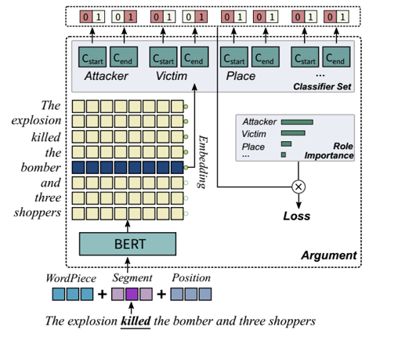
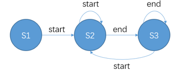
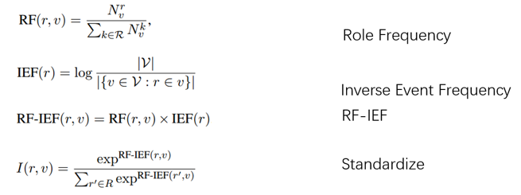
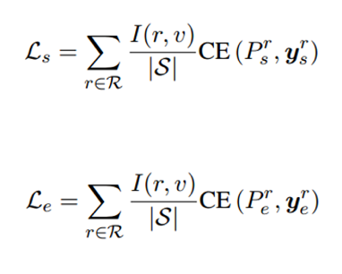
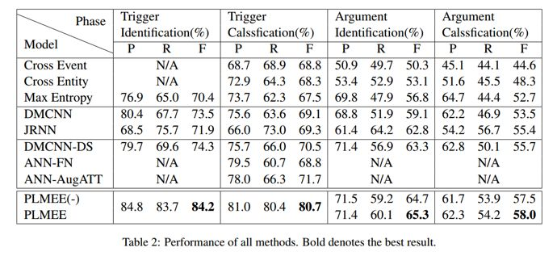

## 探索将预训练语言模型用于事件抽取和事件生成

> 论文笔记整理：郝凯龙，南京大学硕士

> 链接：https://www.aclweb.org/anthology/P19-1522.pdf

## **动机**

传统的 ACE 事件抽取任务依赖于人工标注的数据，耗费大量的人力并且数据量有限，数据量不足给事件抽取带来了阻碍。传统的事件抽取不能解决 role overlap 角色重叠的问题。PLMEE 模型通过对不同的角色分别进行 augument prediction 论元预测解决了角色重叠问题。另外，论文提出了一种利用BERT生成训练数据的方法，并证明有效。在 ACE2005 数据集上，超过了 state-of-the-art 的结果，将触发词分类和论元分类的 F1 值分别提高到了 81.1 和 58.9。

## **亮点**

PLMEE 的亮点主要包括：

（1）解决了一个论元扮演多个角色即角色重叠问题，通过对不同的角色构建多个分类器的方式。例如“The explosion killed thebomber and three shopers”在这句话中，bomber既是Attacker也是Victim。

（2）提出了利用BERT生成训练数据的方法，并证明方法有效。

## **概念及模型**
- **事件抽取**
事件抽取分为触发词抽取、论元抽取、论元范围检测、损失函数重写

1.    触发词抽取

将触发词抽取建模为多分类问题，在BERT后添加MLP做分类，用cross-entropy作为损失函数。

2.    论元抽取

对于每一个token有多组二分类器，每个分类器决定改token是否为对应role的开头或结尾。通过这种方式，一个token/argument可以是多个role，可解决role overlap问题。

3.    论元范围检测

利用一个有限自动机，进行短语的检测，可以表示成下图：

尽可能的选择概率更高的token作为argument的开头和结尾。并且可以为一个role检测出多个argument。

4.    损失函数重写

按照TF-IDF的方式，计算不同role的重要程度，作为weight。

r表示role，即角色。v 代表某一事件类型，V代表所有事件类型集合。

对RF-IEF规范化，得到I(r, v)代表对于事件v角色r的重要程度。

Ls表示start，即论元开头的loss；Le表示end的损失。两者求和为最终的损失函数。

- **事件生成**

首先在数据集中进行论元收集，将角色相同并且上下文相似的token/phrase构成集合，如上图框中示例。

对于句子，对其中的argument论元，在构建的相似集合中随机选择进行替换。

对于触发词和论元以外的词，即附加词，利用bert进行[mask]遮掩，利用BERT预测的结果作为替换。

 

最后得到打分函数，用于筛选生成数据。

## **理论分析**

### **实验**

1.     实验结果

作者采用了相较于以往方法更严苛的评判标准。

但是实验的结果依然是极好的，对于Trigger Identification触发词检测和Trigger Classification触发词分类甚至提升了10%

 

1.     触发词只有类型和范围均检测正确，才认为结果正确

2.     论元只有范围正确，并且所有的role overlap重叠角色均被检测出来，才认为结果正确。

## **总结**

本文利用预训练语言模型，对事件抽取证明有极大的提高，说明 BERT 得到的 embedding 蕴含的语义信息是非常有意义的。另外，采用 BERT 生成数据也是一种不错的思路。对于 role overlap 等问题，论文提出了一种基于多分类器的改进方式。
