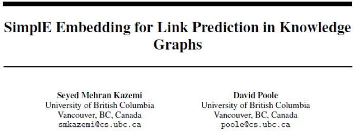
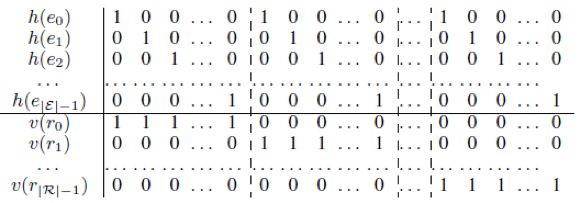

## 用于知识图中链接预测的嵌入方法 SimplE

&gt; 笔记整理: 

论文笔记整理：黄佳程，南京大学硕士生，研究方向为知识图谱、实体消解。

链接：https://papers.nips.cc/paper/7682-simple-embedding-for-link-prediction-in-knowledge-graphs.pdf

## **动机**

张量分解方法被证明是一种有效的用于知识图谱补全的统计关系学习方法。最早提出的张量分解方法为CP分解（canonical Polyadicdocomposition），这种方法为每个实体学习出一个头实体嵌入和一个尾实体嵌入，而头尾嵌入是独立的。这导致了该方法在补全上性能较差。SimplE基于CP方法提出了一种张量分解方法，解决其训练中头尾无关的问题。

## ****

## **亮点**

SimplE 的亮点主要包括：

（1）SimplE可以被看成一种双线性模型，与其他模型相比，它具有完全表达能力，同时冗余参数少。

（2）SimplE可以通过参数共享的方式将背景知识编码进嵌入中。

## 

## **概念及模型**

## **1**.   

其中 v,w,x为3个d维向量，v[j], w[j], x[j]分别表示向量v,w,x的第j个分量

**2**. 图谱中的关系类型（ζ表示正例，ζ’表示反例）：

a)       自反性：

b)      对称性：

c)       反对称性：

d)      传递性：

**3**.       SimplE模型

a) 实体和关系的表示：每个实体e具有两个嵌入h_e和t_e,分别表示其在头实体和尾实体中的表示，每个关系有两个表示

b) 三元组(e_i,r,e_j)的打分函数：

该打分函数可以看成(e_i,r,e_j)和(e_j,r^-1,e_j)的CP打分的平均值

c) 在实验中，SimplE-ignr的打分函数仅为第一项CP打分，作为一种对比方法

**4**. SimplE 模型的学习过程：训练中使用随机梯度下降，返利生成方法和 TransE 相同。优化目标为带L2正则化的负对数似然函数：

**5**. SimplE 利用背景知识的方法：

a) 对于自反的关系r和r^-1，可以通过绑定v_r和v_r^-1两个参数

b) 对于反对称关系，可以将v_r^-1绑定成-v_r

c) 对于关系r_1,r_2使得(e_i,r_1,e_j)和(e_j,r_2,e_i)总是同时成立，可以绑定两个关系的v_r和v_r^-1两个参数

## 理论分析

1.     SimplE 模型的完全表达能力：当嵌入维数充分大时，SimplE 能够完全表示 ground truth。

2. FSTransE 嵌入模型中：1.自反关系总是对称的；2.自反关系总是传递的；3.e1和Δ的所有实体具有关系r，e_2和Δ中的一个实体具有关系r，则e2和Δ中的所有实体具有关系r。其他变体TransE，FTransE，STransE，TransH等也有同样的缺陷。

3.     DistMult，ComplEx，CP和SimplE都可以看作双线性模型（需要把SimplE的头尾表示拼接作为一个实体的单一嵌入），这时他们关系表示的参数如下图：

4.     ComplEx的参数规模为SimplE的2倍，并且存在冗余

## 

## **实验**

1.     实验结果

作者与WN18和FB15K在两个基准数据集上进行了比较，结果显示了SimplE都取得了较好的效果。

## 总结

本文提出了一种简单可解释且具有完全表达能力的双线性模型用于知识图谱补全。文章证明了SimplE模型在实验中性能良好，并且具有编码先验知识的能力。

**OpenKG**

开放知识图谱（简称 OpenKG）旨在促进中文知识图谱数据的开放与互联，促进知识图谱和语义技术的普及和广泛应用。

点击**阅读原文**，进入 OpenKG 博客。
