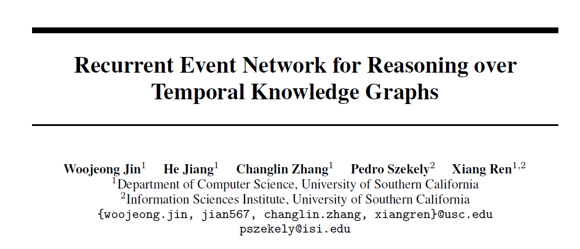
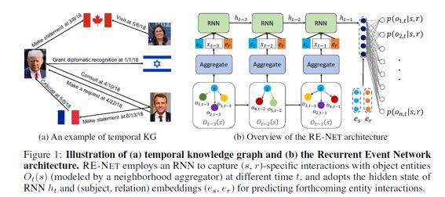
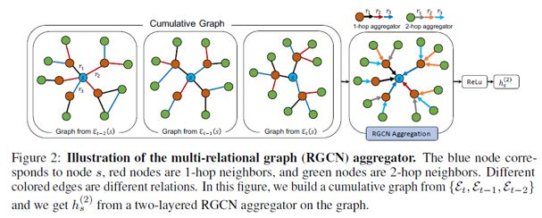
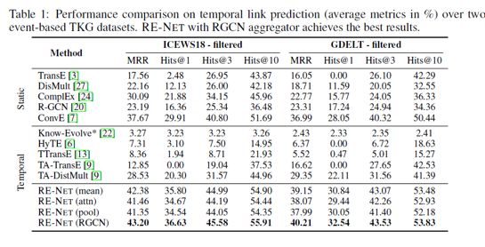

## 面向时序知识图谱推理的循环事件网络

> 论文笔记整理：谭亦鸣，东南大学博士生，研究方向为知识库问答。

> 来源：arXiv (short version accepted at ICLR 2019Workshop on Representation Learning on Graphs and Manifolds)

> 链接：https://arxiv.org/abs/1904.05530

 
本文提出了一种建模时序、多关系、图结构数据的神经网络方法，称为循环事件网络(RE-NET），该模型由RNN事件序列编码器和近邻聚合模型组成。其中，近邻聚合模型将每一时刻主实体通过关系连接的邻居（一跳或两跳）进行信息聚合，与主实体（Subject）、关系（Relation）的向量表示一同作为RNN的输入，从而实现数据建模，用于预测某时刻主体事件s在关系r上对应的客体事件o，（假定图谱四元组表示为(s, r, o, t)，任务目标是预测(s, r, ?, t)或(?, r, o, t)中的？）。

 

## **思路**

本文方法的关键思路包括：

1. 时序图谱可以被看作具有多个相互关系的序列；

2. 实体间的多个相互关系可能发生在同一时刻；

3. 时序邻居关系之间存在强依赖；

4. 多关系情况下，当前邻居可以帮助预测未来（实体之间的）相互关系。

 

 

## **方法**

框架描述

图1（左）描述事件图形式构成为：(Subject，Relation，Object，Time)，其中Subject与Object为事件的主客体，Relation则代表事件本身，事件具有时间信息；

图1（右）是事件图embedding和Object事件预测的流程框架，该模型的整体框架由事件序列编码器（event sequence encoder）与近邻聚合模型（neighborhood aggregation module）构成。

对于某一主体实体es，假定我们需要推断它在t时刻的事件客体是什么，过程描述如下：

1. 对于历史时刻(图中为t-1, t-2, t-3)，将各时刻es包含的邻居实体聚合为x，与es及关系er一起作为RNN的输入

2. 将RNN末端（即时间t）得到的隐状态取出，与es和关系er融合给出t时刻e和er对应的客体o的概率分布

3. 完成t时刻客体o的预测

 

事件序列编码器（event sequence encoder）

RE-NET的目标是表示时序图谱，假定表示t时刻发生的事件集合，当我们要预测这个集合时，显然需要将t时刻之前的历史信息作为参照，得到一个条件概率表示，那么我们要预测的客体o则可以通过以下式子得到：

且可以改写为：

由此可以得到事件序列编码函数形如:

函数f的参数作为RNN编码器的输入。

 

近邻聚合模型（neighborhood aggregation module）

作者列举了四种可选近邻聚合策略：

Mean Aggregator取与主体s相关的客体o的平均作为聚合结果，并不考虑不同的o具有的重要性；

Attentive Aggregator对于主客体之间添加注意力，反映其之间的相关程度

Pooling Aggregator对主体和邻居之间做卷积，可表示为：

RGCN Aggregator使用多层神经网络进行邻居聚合，考虑两跳邻居，公式形如：

下图是对两跳邻居聚合的示意图：

 

## **实验**

**数据集**

本文实验使用到了四个数据集：包含两个基于事件的时序知识图谱（Integrated Crisis Early Warning System (ICEWS18)，Global Database of Events, Language, and Tone(GDELT)）及两个包含时序信息的知识图谱（WIKI, YAGO）

每个数据集依据时间戳，均被划分为80%训练集，10%验证集，10%测试集；即训练集的时序排在验证集之前，验证集在测试集之前。

评价策略使用了Mean Reciprocal Ranks和Hits@1/3/10两种 

**实验结果**

本文参照的Baseline被分为统计方法（TransE, DisMult，ComplEx, R-GCN, ConvE）和时序推理方法（Know-Evolve, TA-TransE/DistMult,HyTE, TTransE）

 

实验结果如下表所示：

